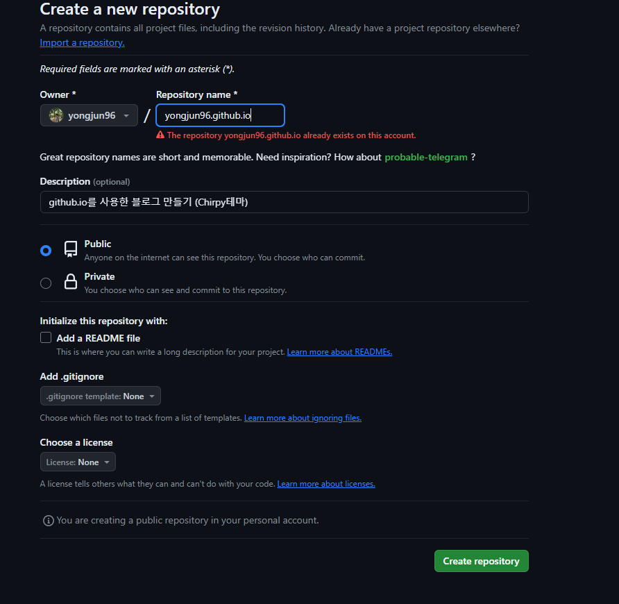
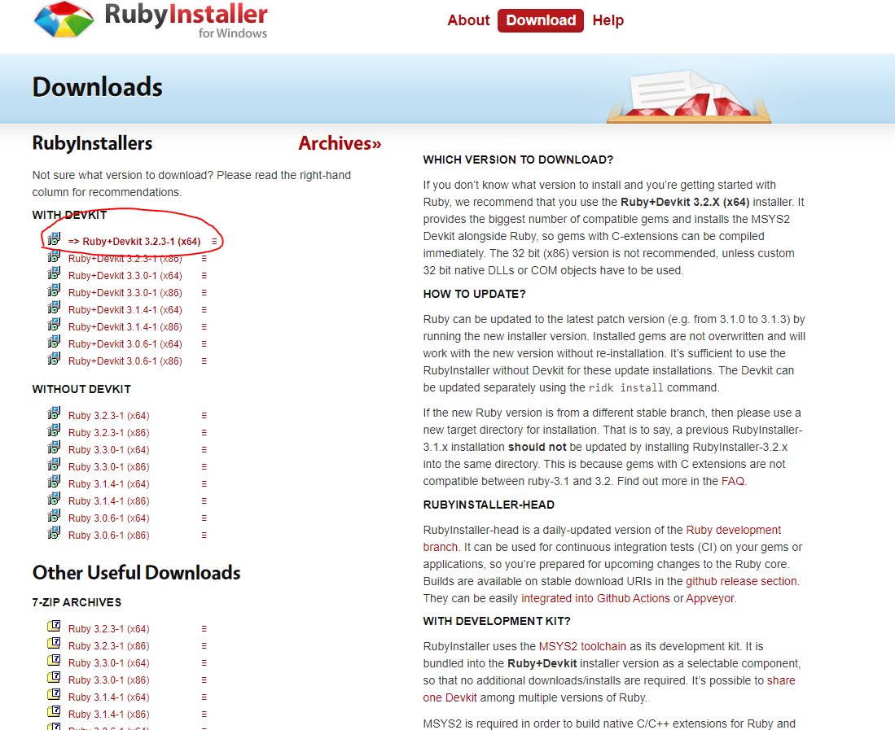
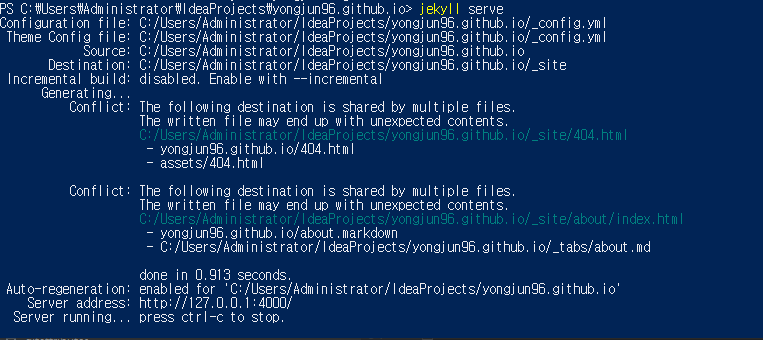
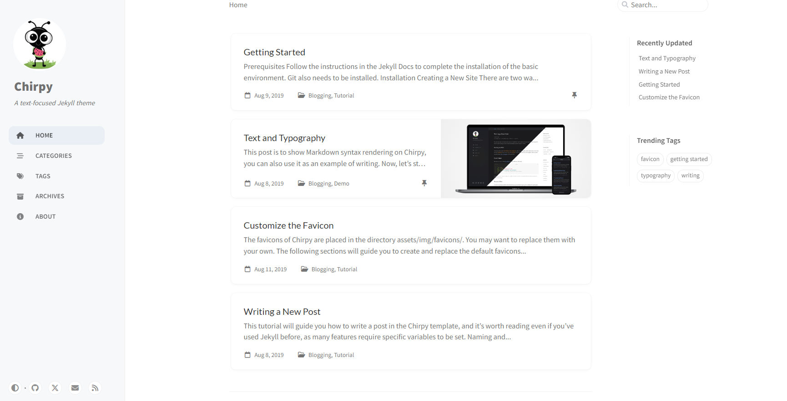

# 1. Repository 만들기

깃허브 접속 후, 
repository를 새로 생성



Repository name은 {github 계정}.github.io 형식으로 만들어 준다.
Create repository 클릭

<span style="color:red">※ The repository yongjun96.github.io already exists on this account.</span><br>
└ 현재 <span style="color:blue">존재</span>하는 repository라는 뜻. (이미 프로젝트를 만들고 글을 쓰고 있어서 그렇다...)
<br><br>
<a href="https://github.com/cotes2020/jekyll-theme-chirpy" target="_blank">https://github.com/cotes2020/jekyll-theme-chirpy</a><br>
해당 프로젝트를 clone하고 만들어 놓은 {github 계정}.github.io repository에 push한다!

<br><br>
# 2. 필요한 모듈 설치


루비 설치 : <a href="https://rubyinstaller.org/downloads/" target="_blank">https://rubyinstaller.org/downloads/</a><br>



<br>
다운로드 받고 설치 (별도의 세팅 없음.)


다운이 끝나면 powerShell로 루비 버전을 확인
```shell
ruby --version
ruby 3.2.3 (2024-01-18 revision 52bb2ac0a6) [x64-mingw-ucrt]
```
<br><br>
Windows powerShell에서 프로젝트가 있는 있는 경로로 이동.<br>
ex). C:\IdeaProjects\yongjun96.github.io

<br><br>

jekyll 실행을 위해 필요한 모듈을 설치

```shell
$ bundle
```


<br><br>


npm을 통해 node.js 모듈을 설치

```shell
npm install && npm run build
```


<br><br>


# 3. jekyll 실행

<br>

jekyll을 실행

```shell
jekyll serve
```



실행이 완료되면 주소로 접속<br>

<a style="color:red" href="http://127.0.0.1:4000" target="_blank">127.0.0.1:4000</a>

<br><br>



<br>

해당 페이지가 나오면 접속 성공


# 4.github 배포

1. github에 해당 프로젝트로 이동

2. Settings - Pages - Build and deployment 에서 소스를 GitHub Actions로 변경

3. Configure를 선택

4. 상태 유지하고 Commit changes…를 선택 후 Commit changes 선택

<br><br>

프로젝트에서 .gitignore -> assets/js/dist 디렉토리 내 파일들의 Push가 무시되도록하는 설정을 주석처리

```shell
# Bundler cache
.bundle
vendor
Gemfile.lock

# Jekyll cache
.jekyll-cache
_site

# RubyGems
*.gem

# NPM dependencies
node_modules
package-lock.json

# IDE configurations
.idea

# Misc
# assets/js/dist
```

<br><br>

.github/workflows 에서 pages-deploy.yml.hook -> pages-deploy.yml (hook을 빼주고 yml파일로 만들어 준다.)<br>
그 후, .github/workflows 경로에 있는 파일들은 전부 삭제

<br>

pages-deploy.yml에서 ruby-version 다운받은 루비 버전과 맞게 입력

```yml
      - name: Setup Ruby
        uses: ruby/setup-ruby@v1
        with:
          ruby-version: 3.2.3
          bundler-cache: true
```
<br><br>

branches도 확인해 준다. (main사용)

```yml
name: "Build and Deploy"
on:
  push:
    branches:
      - main
      - master
    paths-ignore:
      - .gitignore
      - README.md
      - LICENSE
```
<br><br>
프로젝트 -> Actions -> Build and Deploy 로 들어와 빌드

<br>


<br><br>

빌드가 완료되면 접속 확인

<a href="https://yongjun96.github.io/" target="_blank">https://yongjun96.github.io/</a>
