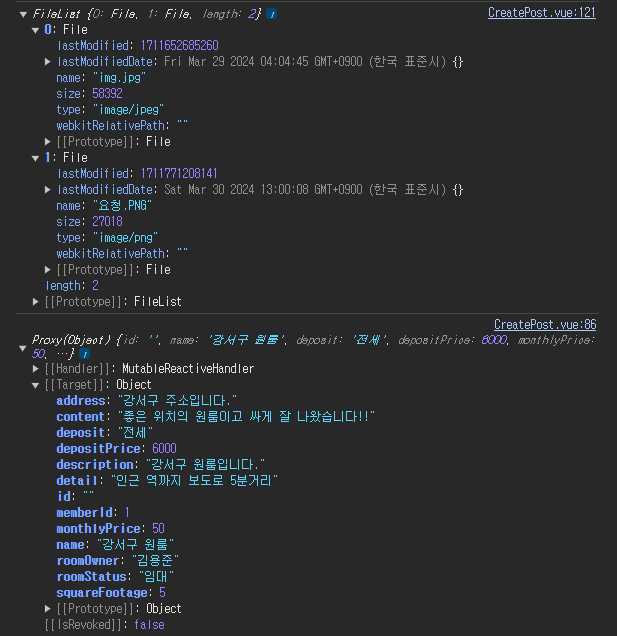

# 문제상황

```java

import jakarta.validation.Valid;
import lombok.RequiredArgsConstructor;
import org.springframework.http.HttpStatus;
import org.springframework.http.ResponseEntity;
import org.springframework.web.bind.annotation.*;
import org.springframework.web.multipart.MultipartFile;
import springboot.yongjunstore.request.RoomPostDto;
import springboot.yongjunstore.service.RoomPostService;

@RestController
@RequiredArgsConstructor
@RequestMapping("/roomPost")
public class RoomPostController {

    private final RoomPostService roomPostService;

    @PostMapping("/create")
    public ResponseEntity roomCreate(@Valid @RequestBody RoomPostRequest roomPostRequest, @RequestParam("uploadFiles") MultipartFile[] uploadFiles){

        roomPostService.createRoom(roomPostDto, uploadFiles);

        return ResponseEntity.status(HttpStatus.OK).build();
    }
}
```
<br>

보통 컨트롤러에서 MultipartFile 요청을 할 때는 `@RequestParam`을 사용했다.  
Dto를 요청할 때는 `@RequestBody`를 주로 사용했고, 잘 될 것만 같았는데 헤더에 토큰을 넣었는데도 이상하게 토큰이 null을 뱉었다.

<br>

```java
import jakarta.servlet.FilterChain;
import jakarta.servlet.ServletException;
import jakarta.servlet.ServletRequest;
import jakarta.servlet.ServletResponse;
import jakarta.servlet.http.HttpServletRequest;
import lombok.RequiredArgsConstructor;
import org.springframework.security.core.Authentication;
import org.springframework.security.core.context.SecurityContextHolder;
import org.springframework.web.filter.GenericFilterBean;
import springboot.yongjunstore.config.jwt.JwtProvider;

import java.io.IOException;

@RequiredArgsConstructor
public class JwtAuthenticationFilter extends GenericFilterBean {

    private final JwtProvider jwtProvider;

    @Override
    public void doFilter(ServletRequest request, ServletResponse response, FilterChain chain) throws IOException, ServletException {

        // 1. Request Header 에서 JWT 토큰 추출
        String accessToken = jwtProvider.resolveToken((HttpServletRequest) request);

        // 2. validateToken 으로 토큰 유효성 검사
        if (accessToken != null && jwtProvider.validateToken(accessToken)) {
            // 토큰이 유효할 경우 토큰에서 Authentication 객체를 가지고 와서 SecurityContext 에 저장
            Authentication authentication = jwtProvider.getAuthentication(accessToken);
            SecurityContextHolder.getContext().setAuthentication(authentication);
        }
        chain.doFilter(request, response);
    }
}
```

왜 이러지?   
혹시나 해서 다른 컨트롤러를 사용해 보니.. 정상적으로 통과 되는 것을 보니 토큰 문제는 아니었다.  
에러 메세지
<br>

`Servlet.service() for servlet [dispatcherServlet] in context with path [] threw exception [Request processing failed: org.springframework.web.multipart.MultipartException: Current request is not a multipart request] with root cause`

해석해 보면, **현재 요청이 멀티파트 요청이 아닌데 멀티파트 요청으로 처리하려고 시도하고 있기 때문에 발생한 것**

하지만 분명히 헤더에 명시했다.

```javascript
      axios.post(import.meta.env.VITE_APP_API_URL + '/roomPost/create', this.roomPostDto, formData, {
  headers: {
    'Authorization': `Bearer ${localStorage.getItem('accessToken')}`,
    'Content-Type': 'multipart/form-data'
  }
})
```
<br>

**'Content-Type': 'multipart/form-data'** <-- 근데 이거 재데로 적용이 된게 맞나??  
<br>
생각해 보니 헤더에 명시 했는데도 request에서 헤더 값을 전부 null로 리턴했다.
뭔가 방식이 잘 못 됐다는 걸 느꼈다..

<br>

그래서 다시 생각해 봤다.  
`@RequestBody` : HTTP 요청의 body를 자바 객체로 변환
<br>
`@RequestParam` : HTTP 요청의 쿼리 파라미터(query parameter)를 매개변수 사용
<br>
같이 못 쓸 이유가 없다.

<br>

---

# 의심 되는 상황

<br>


1. `Content-Type`이 `@RequestBody`를 json으로 변환 시켜야 해서 `application/json`으로 고정 되는 건가?
<br>
2. `multipart/form-data`로 `Content-Type`이 잡혀서 json으로 변환을 못시키는 건가?
<br>
3. `MultipartFile[]`은 단독으로 사용해야만 하는 건가?

<br>

결론은 `multipart/form-data`를 사용하는 것으로 헤더에 넘겼기 때문에 json으로 처리하지 못했고, Dto 또한 마찬가지 였던 것 이었다.
<br>
그 예로, `multipart/form-data`을 `application/json`으로 헤더에 입력하면

<br>
에러 메세지

`Servlet.service() for servlet [dispatcherServlet] in context with path [] threw exception [Request processing failed: org.springframework.web.multipart.MultipartException: Current request is not a multipart request] with root cause`
<br>

요약하자면 결국, **멀티파트로 요청해야 하는데 현재 요청이 멀티파트 요청이 아니다.**

<br>

## 문제 파악
<br>

`multipart/form-data` 요청 시 : <span style="color:#FA5858;">**현재 요청이 멀티파트 요청이 아닌데 멀티파트 요청으로 처리하려고 시도하고 있기 때문에 발생한 것**</span>
<br>

`application/json` 요청 시 : <span style="color:#FA5858;">**멀티파트로 요청해야 하는데 현재 요청이 멀티파트 요청이 아니다.**</span>

<br>

하나의 `Content-Type`으로 서로 다른 타입의 객체를 처리하려고 해서 발생한 문제였다...
<br>
**천천히 생각해 보면 매우 간단한 문제였던 것..**

<br>

---

<br>

# 또 다른 문제


<br>

### @RequestPart 사용


<br>

`@RequestPart`를 사용해서 처리하는 방법을 생각했다.
<br>

```java
import jakarta.validation.Valid;
import lombok.RequiredArgsConstructor;
import lombok.extern.slf4j.Slf4j;
import org.springframework.http.HttpStatus;
import org.springframework.http.ResponseEntity;
import org.springframework.web.bind.annotation.*;
import org.springframework.web.multipart.MultipartFile;
import springboot.yongjunstore.request.RoomPostRequest;
import springboot.yongjunstore.service.RoomPostService;

import java.util.List;

@RestController
@RequiredArgsConstructor
@Slf4j
@RequestMapping("/roomPost")
public class RoomPostController {

    private final RoomPostService roomPostService;

    @PostMapping(value = "/create")
    public ResponseEntity roomCreate(@Valid @RequestPart(value = "roomPostRequest", required = false)RoomPostRequest roomPostRequest, 
                                            @RequestPart(value = "uploadImages", required = false) List<MultipartFile> uploadImages){
        
        roomPostService.createRoom(roomPostRequest, uploadImages);

        return ResponseEntity.status(HttpStatus.OK).build();
    }
}
```

이미지 파일과 `RoomPostRequest`를 formData에 넣어서 요청하기로 했다.

<br>

```javascript

const formData = new FormData();

// roomPost Json을 formData에 담기
formData.append('roomPostRequest', JSON.stringify(this.roomPostRequest));

// 업로드된 이미지 uploadImages 담기.
for (let i = 0; i < this.files.length; i++) {
  formData.append('uploadImages', this.files[i]);
}


axios.post(import.meta.env.VITE_APP_API_URL + '/roomPost/create', formData, {
  headers: {
    'Authorization': `Bearer ${this.token}`,
    'Content-Type': 'multipart/form-data',
    //'Content-Type': 'application/json'
  }
})
```
<br>

이렇게 하면 정상적으로 처리될 줄... 알았다.

```text
error : "Unsupported Media Type"
path : "/roomPost/create"
status : 415
```
`Unsupported Media Type` : 지원되지 않는 형식으로 요청을 해서 요청에 대한 승인을 거부

<br>

해당 415과 400을 번갈아 가며 만나고 구글과 GPT를 혹사해가며 해결하려 했지만 방법을 찾기 못해서 다른 해결방안을 찾았다.

<br>

---

# 해결


바로 `@ModelAttribute`를 사용해서 해결하는 방법!!

```java
import jakarta.validation.Valid;
import lombok.RequiredArgsConstructor;
import lombok.extern.slf4j.Slf4j;
import org.springframework.http.HttpStatus;
import org.springframework.http.ResponseEntity;
import org.springframework.web.bind.annotation.*;
import org.springframework.web.multipart.MultipartFile;
import springboot.yongjunstore.request.RoomPostRequest;
import springboot.yongjunstore.service.RoomPostService;
import java.util.List;

@RestController
@RequiredArgsConstructor
@Slf4j
@RequestMapping("/roomPost")
public class RoomPostController {

    private final RoomPostService roomPostService;

    @PostMapping(value = "/create")
    public ResponseEntity roomCreate(@Valid @ModelAttribute RoomPostRequest roomPostRequest,
                                            @RequestPart(value = "uploadImages") List<MultipartFile> uploadImages){

        roomPostService.createRoom(roomPostRequest, uploadImages);

        return ResponseEntity.status(HttpStatus.OK).build();
    }
}
```

요청 타입은 프론트에서 `fromData` 그대로 받이주고 `RoomPostRequest`을 `@ModelAttribute`로 해 주었다.

<br>

```javascript
const formData = new FormData();

// roomPostDto를 JSON으로 미리 변환해서 formData에 넣는다.
for (const key in this.roomPostRequest) {
  if (Object.prototype.hasOwnProperty.call(this.roomPostRequest, key)) {
    formData.append(key, this.roomPostRequest[key]);
    console.log(this.roomPostRequest[key]);
  }
}

// 업로드된 이미지 uploadImages 담기.
for (let i = 0; i < this.files.length; i++) {
  formData.append('uploadImages', this.files[i]);
}


axios.post(import.meta.env.VITE_APP_API_URL + '/roomPost/create', formData, {
  headers: {
    'Authorization': `Bearer ${this.token}`,
    'Content-Type': 'multipart/form-data',
    //'Content-Type': 'application/json'
  }
})
```

<br>

대신 key, value 형태로 한땀 한땀 반복문을 사용해 `formData`에 추가해 주었다.

<br>



정상적으로 요청되었고, 값도 잘 저장되는 것을 확인했다
하지만 `@ModelAttribute`를 사용하지 않고 `@RequestPart`로 해결하고 싶은 마음이 여전히 남아 있어 찝찝한 느낌이 남은 해결이었다.

<br>

리펙토링을 하게된다면 다시 한번 해당 코드를 수정해야 될 것 같다. 
